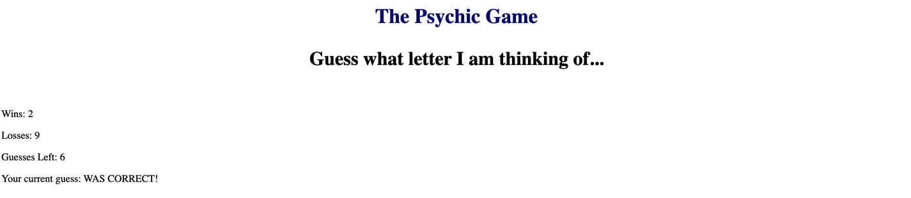

# Psychic-Game

Demo a live version of the application here: [https://mkchung8.github.io/Psychic-Game/]

'Psychic-Game' is a game application where the app randomly selects a letter and the user must guess the correct letter with 10 attempts. The application tracks the score and number of guesses left for the round. The game ends when a score of 10 has been reached. 

The purpose of this application is to explore logic using JavaScript to create a functional game application. 

## Getting Started 

To use this game application, click on the link to the live demo listed above or clone the repository onto your machine. You can then navigate to the root directory on your code editor to view the application on your browser. 

User will initiate the game once they hit any letter on their keyboard. 

The user will have 9 attempts per round to correctly guess the letter. The application keeps track of the user and computer score, as well as letters that have already been guessed by the user. The game will end once a score of ten has been reached by either player. To restart the game, simply press any key on the keyboard. 

## Technologies Used 
* HTML/CSS 
* JavaScript 

#### Code Created and Maintained by: 
Miyoung K. Chung 
mkchung.8@gmail.com
https://www.github.com/mkchung8/
https://www.linkedin.com/in/mkchung8/
